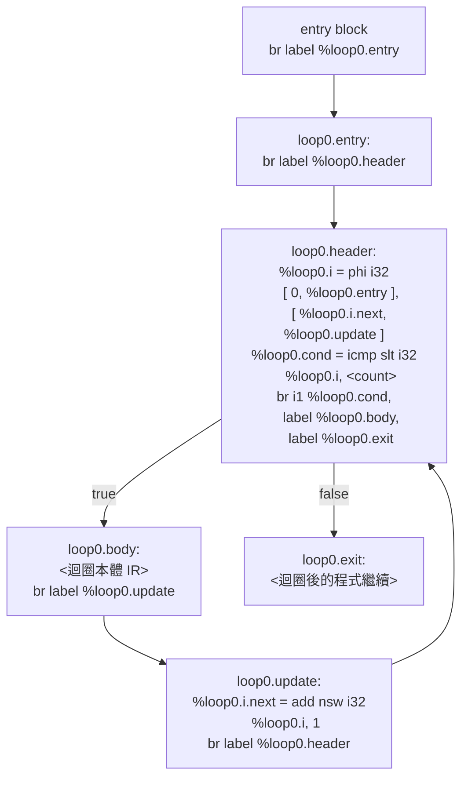

# LLVM IR Cheatsheet — 文言文編譯器作業專用

作業實際會用到的所有 IR 模式，命名慣例與框架完全一致。這是參考，有自己的想法可以自行修改、延伸。

實作 IR 生成函式時查。遇到指令不確定怎麼寫回來對照即可。

相關文件：[作業說明](https://hackmd.io/@WavJaby/NCKU_1142_COMPILER_HW2)　[README](README.md)　[YACC Cheatsheet](YACC_CHEATSHEET.md)

---

## 基本觀念

### 虛擬暫存器 vs 記憶體變數

LLVM IR 有兩種「存放值」的方式：

| 方式 | 語法 | 對應概念 |
|------|------|---------|
| 虛擬暫存器 | `%reg0` | 計算中間值，只能寫一次（SSA） |
| 記憶體位址 | `%var.0`（由 `alloca` 分配） | 可多次 `store`/`load` 的區域變數 |

**作業命名規則：**
- 運算暫存器：`%reg<registerCount>`（由 `object_createRegisterSymbol` 分配）
- 區域變數：`%var.<variableCount>`（由 `scope_addSymbol` 分配）

### `%%` 的問題

`buffPrintln` 內部呼叫 `printf`，所以 `%` 必須寫成 `%%`：

```c
buffPrintln(&ctx->code, "%%var.%d = alloca i32", symbol->index);
// 輸出：%var.0 = alloca i32
```

---

## 變數宣告、賦值、讀取

### alloca — 分配區域變數空間

```llvm
%var.0 = alloca i32       ; 整數變數
%var.1 = alloca i64       ; 長整數
%var.2 = alloca double    ; 浮點數
%var.3 = alloca i1        ; 布林
%var.4 = alloca ptr       ; 字串或陣列（指標）
```

```c
// 對應 buffPrintln 寫法：
buffPrintln(&ctx->code, "%%var.%d = alloca %s", symbol->index, llvmTypeName);
```

### store — 寫入值

```llvm
store i32 42, ptr %var.0
store double 3.14, ptr %var.2
store i1 1, ptr %var.3       ; true = 1, false = 0
store ptr %reg5, ptr %var.4  ; 字串/陣列存指標
```

```c
buffPrintln(&ctx->code, "store %s %s, ptr %%var.%d",
            llvmTypeName, regName, symbol->index);
```

### load — 讀取值

```llvm
%reg0 = load i32, ptr %var.0
%reg1 = load double, ptr %var.2
```

`object_nameLiteralOrLoadReg` 的 `SYMBOL` 分支自動輸出此指令，呼叫端不需手動寫。

---

## 型別對照表

| ObjectType | LLVM 型別 | `objectType2llvmType[]` |
|------------|----------|------------------------|
| `OBJECT_TYPE_I32` | `i32` | `"i32"` |
| `OBJECT_TYPE_I64` | `i64` | `"i64"` |
| `OBJECT_TYPE_F64` | `double` | `"double"` |
| `OBJECT_TYPE_BOOL` | `i1` | `"i1"` |
| `OBJECT_TYPE_STR` | `ptr` | `"ptr"` |
| `OBJECT_TYPE_ARRAY` | `ptr` | `"ptr"` |

---

## 算術運算

### 整數運算（i32 / i64）

```llvm
%reg2 = add nsw i32 %reg0, %reg1    ; 加
%reg2 = sub nsw i32 %reg0, %reg1    ; 減
%reg2 = mul nsw i32 %reg0, %reg1    ; 乘
%reg2 = sdiv i32 %reg0, %reg1       ; 除（有號整數）
%reg2 = srem i32 %reg0, %reg1       ; 餘數（mod）
```

`nsw`（No Signed Wrap）= 溢位時為 undefined behavior，用於整數加減乘。

### 浮點數運算（double）

```llvm
%reg2 = fadd double %reg0, %reg1
%reg2 = fsub double %reg0, %reg1
%reg2 = fmul double %reg0, %reg1
%reg2 = fdiv double %reg0, %reg1
```

### 作業用法

`opIRIntNames[eop]` 對應整數 IR opcode，`opIRFloatNames[eop]` 對應浮點數：

```c
const char* opType = ObjectType_isFloat(targetType)
    ? opIRFloatNames[eop]
    : opIRIntNames[eop];
buffPrintln(&ctx->code, "%%reg%s = %s %s %s, %s",
            resultReg.name, opType, llvmTypeName, cacheA, cacheB);
```

---

## 型別升級（Type Promotion）

作業中 I32 → I64 → F64 單向升級，`object_loadRegAndPromote` 自動輸出以下 IR：

### sext — 有號整數擴展（i32 → i64）

```llvm
%reg1 = sext i32 %reg0 to i64
```

### sitofp — 整數轉浮點（i32/i64 → double）

```llvm
%reg1 = sitofp i32 %reg0 to double
%reg1 = sitofp i64 %reg0 to double
```

手動很少需要寫這兩條，讓 `object_loadRegAndPromote` 處理即可。

---

## 比較運算

### icmp — 整數 / 指標比較

```llvm
%reg2 = icmp slt i32 %reg0, %reg1   ; signed less than (<)
%reg2 = icmp sgt i32 %reg0, %reg1   ; signed greater than (>)
%reg2 = icmp sle i32 %reg0, %reg1   ; signed less or equal (<=)
%reg2 = icmp sge i32 %reg0, %reg1   ; signed greater or equal (>=)
%reg2 = icmp eq  i32 %reg0, %reg1   ; equal (==)
%reg2 = icmp ne  i32 %reg0, %reg1   ; not equal (!=)
```

結果型別固定是 `i1`（bool）。

### fcmp — 浮點比較

```llvm
%reg2 = fcmp olt double %reg0, %reg1   ; ordered less than
%reg2 = fcmp ogt double %reg0, %reg1
%reg2 = fcmp ole double %reg0, %reg1
%reg2 = fcmp oge double %reg0, %reg1
%reg2 = fcmp oeq double %reg0, %reg1
%reg2 = fcmp one double %reg0, %reg1
```

`opIRIntNames` / `opIRFloatNames` 已包含正確的 icmp/fcmp 變體，透過 `opIRIntNames[eop]` 取得即可。

---

## 邏輯運算（i1）

```llvm
%reg2 = and i1 %reg0, %reg1    ; &&
%reg2 = or  i1 %reg0, %reg1    ; ||
```

---

## 跳轉與 Label

### 無條件跳轉

```llvm
br label %target
```

```c
buffPrintln(&ctx->code, "br label %%loop%d.body", scope->id);
```

### 條件跳轉

```llvm
br i1 %cond, label %true_label, label %false_label
```

### Label 定義

Label 定義行**不縮排**，使用 `buffPrintlnS`；其餘指令用 `buffPrintln`（自動縮排）：

```llvm
if0.true:           ← buffPrintlnS，無縮排
    store i32 ...   ← buffPrintln，有縮排
```

> `buffPrintlnS` = "S" 代表 Statement-level（無縮排）

### `%%` 轉義規則

`buffPrintln` 內部呼叫 `printf`，格式字串中的 `%` 必須寫成 `%%` 才能輸出單個 `%`：

| 想輸出的 IR | buffPrintln 格式字串 |
|------------|---------------------|
| `%loop0.i` | `"%%loop%d.i"` |
| `%reg5` | `"%%reg%s"` |
| `%if0.true` | `"%%if%d.true"` |
| `%var.3` | `"%%var.%d"` |

---

## phi 節點（SSA for 迴圈）

### 為什麼需要 phi

LLVM IR 是 SSA（Static Single Assignment）形式：**每個虛擬暫存器只能被賦值一次**。

問題：for 迴圈的計數器需要在每次迭代後更新，但 SSA 不允許同一個暫存器被賦值兩次。

解法：`phi` 節點——根據「從哪個 block 跳過來」決定暫存器的值：

```llvm
%loop0.i = phi i32 [ 0, %loop0.entry ],          ; 從 entry 來時 = 0（初始值）
                   [ %loop0.i.next, %loop0.update ] ; 從 update 來時 = 上次更新後的值
```

### for 迴圈完整結構



### `code_forLoop` 需要輸出的 IR 序列

對照上方流程圖，按 TODO 步驟順序輸出以下 IR（用 `buffPrintln` / `buffPrintlnS`）：

| 步驟 | 輸出的 IR | 說明 |
|------|----------|------|
| entry 進入 | `br label %loop<id>.entry` | 跳進迴圈 entry block |
| entry label | `loop<id>.entry:` | 用 `buffPrintlnS`，無縮排 |
| 取計數值 | （無 IR，呼叫 `object_loadRegAndPromote`） | 把計數 Object 轉成 IR 運算元字串 |
| header 跳轉 | `br label %loop<id>.header` | |
| header label | `loop<id>.header:` | 用 `buffPrintlnS` |
| **phi 節點** | `%loop<id>.i = phi <type> [ 0, %loop<id>.entry ], [ %loop<id>.i.next, %loop<id>.update ]` | SSA 計數器；兩個來源 block 名稱必須與實際 label 一致 |
| 比較 | `%loop<id>.cond = icmp slt <type> %loop<id>.i, <count>` | `slt` = signed less than |
| 條件跳轉 | `br i1 %loop<id>.cond, label %loop<id>.body, label %loop<id>.exit` | |
| body label | `loop<id>.body:` | 用 `buffPrintlnS`，之後進入迴圈本體 |

### `code_forLoopEnd` 需要輸出的 IR 序列

| 步驟 | 輸出的 IR | 說明 |
|------|----------|------|
| 跳回 update | `br label %loop<id>.update` | 從 body 跳到計數器更新 block |
| update label | `loop<id>.update:` | 用 `buffPrintlnS` |
| 計數器遞增 | `%loop<id>.i.next = add nsw <type> %loop<id>.i, 1` | `nsw` = no signed wrap |
| 回到 header | `br label %loop<id>.header` | 進入下一次條件判斷 |
| exit label | `loop<id>.exit:` | 用 `buffPrintlnS`，迴圈結束後繼續 |

> `<id>` = `scope->id`，`<type>` = `objectType2llvmType[loop->symbol.type]`

---

## while 迴圈結構

比 for 簡單許多，無 phi 節點：

```
loop0.body:        ← 迴圈本體入口
  <本體 IR>
  br label %loop0.body   ← 回到頂端

loop0.exit:        ← break 跳到這裡
```

`code_whileLoopStart` 與 `code_whileLoopEnd` 已完整提供，只需實作 `code_break`。

`code_break` 的作用是：找到最近的迴圈 scope，輸出一條**無條件跳轉**到該迴圈 exit label 的 IR：

```llvm
br label %loop<id>.exit
```

實作前先讀 `scope_findNearestLoop()` 的回傳值說明，以及 `code_whileLoopEnd` / `code_forLoopEnd` 裡 exit label 的命名方式，確認名稱一致再輸出。

---

## if / elseif / else 結構

### 僅 if（無 else）

```
          br i1 %cond, label %if0.true, label %if0.false
if0.true:
          <true 本體>
          br label %if0.false     ← code_ifEnd 的 elseifCount==0 路徑
if0.false:
          <繼續>
```

### if + else

```
          br i1 %cond, label %if0.true, label %if0.false
if0.true:
          <true 本體>
          br label %if0.endif
if0.false:
          <else 本體>
          br label %if0.endif
if0.endif:
          <繼續>
```

### if + elseif + else（elseifCount = 1）

```
          br i1 %cond0, label %if0.true, label %if0.false
if0.true:
          <if 本體>
          br label %if0.endif
if0.false:                         ← code_elseIfLabel 輸出
          br i1 %cond1, label %if0.elseif0.true, label %if0.elseif0.false
if0.elseif0.true:
          <elseif 本體>
          br label %if0.endif
if0.elseif0.false:                 ← code_ifEnd 的 hasElseif 無 else 路徑
          br label %if0.endif
if0.endif:
          <繼續>
```

### Label 命名規則

| Label | 時機 |
|-------|------|
| `if<id>.true` | if 條件成立 |
| `if<id>.false` | if 條件不成立（無 elseif 時 = 結束點） |
| `if<id>.elseif<n>.true` | 第 n 個 elseif 成立（n 從 0 開始） |
| `if<id>.elseif<n>.false` | 第 n 個 elseif 不成立 |
| `if<id>.endif` | 所有分支結束後的匯合點（有 else 或 elseif 時需要） |

---

## 輸出函式

### printf — 格式化輸出（數字、字串）

```llvm
call i32 (ptr, ...) @printf(ptr @fmt_i32_n, i32 %reg0)
call i32 (ptr, ...) @printf(ptr @fmt_i64_n, i64 %reg1)
call i32 (ptr, ...) @printf(ptr @fmt_double_n, double %reg2)
call i32 (ptr, ...) @printf(ptr @fmt_ptr_n, ptr %reg3)
```

格式字串命名：`@fmt_<llvmType>[_n]`（`_n` 代表附換行）

| 全域常數 | 格式 | 適用 |
|---------|------|------|
| `@fmt_i32` / `@fmt_i32_n` | `%d` | I32 |
| `@fmt_i64` / `@fmt_i64_n` | `%lld` | I64 |
| `@fmt_double` / `@fmt_double_n` | `%g` | F64 |
| `@fmt_ptr` / `@fmt_ptr_n` | `%s` | STR |

```c
// buffPrintln 寫法
buffPrintln(&ctx->code,
    "call i32 (ptr, ...) @printf(ptr @fmt_%s%s, %s %s)",
    objectType2llvmType[srcValueType],
    newLine ? "_n" : "",
    objectType2llvmType[srcValueType],
    regName);
```

### fwrite — 原始位元組輸出（布林、空格）

```llvm
call i64 @fwrite(ptr @space, i64 1, i64 1, ptr %g_stdout)
call i64 @fwrite(ptr %reg_ptr, i64 1, i64 %reg_len, ptr %g_stdout)
```

布林輸出用 `select` 選 `@str_true[_n]` / `@str_false[_n]`，已在 `code_stdoutPrintObject` 的 BOOL case 提供完整實作，直接參考即可。

### select — 條件選值（三元運算子）

```llvm
%reg1 = select i1 %cond, ptr @str_true_n, ptr @str_false_n
%reg2 = select i1 %cond, i64 6, i64 6    ; 兩個長度（中文 UTF-8 長度）
```

---

## Runtime 函式

`writeOutputHeader` 已宣告，作業中直接呼叫：

| 函式 | 用途 | 簽名 |
|------|------|------|
| `@wy_rt_str_concat` | 字串連接 | `ptr (ptr, ptr)` |
| `@wy_rt_str_length` | 字串長度（UTF-8 字數） | `i64 (ptr)` |
| `@wy_rt_array_new` | 建立新陣列 | `ptr (i64)` |
| `@wy_rt_array_add_ptr` | 陣列 push | `void (ptr, ptr)` |
| `@wy_rt_array_get_ptr` | 陣列索引取值 | `ptr (ptr, i64)` |
| `@wy_rt_array_get_length` | 陣列長度 | `i64 (ptr)` |

```llvm
; 字串長度
%reg0 = call i64 @wy_rt_str_length(ptr %reg_str)

; 陣列長度
%reg0 = call i64 @wy_rt_array_get_length(ptr %reg_arr)

; 字串連接（OP_ADD + STR）
%reg2 = call ptr @wy_rt_str_concat(ptr %reg_a, ptr %reg_b)
```

---

## 記憶體管理速查（object_free 規則）

這是最容易出 bug 的地方：

| 情況 | 要不要 free |
|------|------------|
| `object_nameLiteralOrLoadReg` 回傳，且 `src->type == OBJECT_TYPE_SYMBOL` | **要 free** 回傳值（新分配的 REGISTER） |
| `object_nameLiteralOrLoadReg` 回傳，`src->type` 是字面值或 REGISTER | **不要 free**（借用 `*src`） |
| `object_loadRegAndPromote` 回傳，且型別有升級（`promoted.type != src->type`） | **要 free** promotedObj |
| `object_loadRegAndPromote` 無升級 | **不要 free** |
| 函式參數 `Object* src` 傳入語意動作後 | 呼叫端（yacc action）負責 free，不要在被呼叫函式裡 free 兩次 |

**標準清理模式：**

```c
char regName[MAX_NAME_LENGTH];
Object regSrc = object_nameLiteralOrLoadReg(src, regName, MAX_NAME_LENGTH);
if (regSrc.type == OBJECT_TYPE_UNDEFINED) goto FAILED;

// ... 使用 regName ...

if (src->type == OBJECT_TYPE_SYMBOL) object_free(&regSrc);  // 有條件 free regSrc
object_free(src);                                            // 永遠 free src
return false;

FAILED:
if (src->type == OBJECT_TYPE_SYMBOL) object_free(&regSrc);
object_free(src);
return true;
```

---

## 完整 IR 輸出範例

### 變數宣告 `吾有一數。曰一。名之曰「甲」。`

```llvm
%var.0 = alloca i32
store i32 1, ptr %var.0
```

### 讀取並印出 `書之`（I32）

```llvm
%reg0 = load i32, ptr %var.0
call i32 (ptr, ...) @printf(ptr @fmt_i32_n, i32 %reg0)
```

### 賦值 `今「甲」是矣`

```llvm
%reg1 = load i32, ptr %var.0   ; 讀取右側值
store i32 %reg1, ptr %var.0    ; 存入目標
```

### 加法運算 `加甲乙`（i32）

```llvm
%reg0 = load i32, ptr %var.0   ; 讀甲
%reg1 = load i32, ptr %var.1   ; 讀乙
%reg2 = add nsw i32 %reg0, %reg1
```

### for 迴圈（執行 3 次）

```llvm
br label %loop0.entry
loop0.entry:
    br label %loop0.header
loop0.header:
    %loop0.i = phi i32 [ 0, %loop0.entry ], [ %loop0.i.next, %loop0.update ]
    %loop0.cond = icmp slt i32 %loop0.i, 3
    br i1 %loop0.cond, label %loop0.body, label %loop0.exit
loop0.body:
    ; <迴圈本體>
    br label %loop0.update
loop0.update:
    %loop0.i.next = add nsw i32 %loop0.i, 1
    br label %loop0.header
loop0.exit:
```

### if / else

```llvm
%reg0 = load i32, ptr %var.0
%reg1 = icmp sgt i32 %reg0, 0

br i1 %reg1, label %if0.true, label %if0.false
if0.true:
    ; <true 本體>
    br label %if0.endif
if0.false:
    ; <else 本體>
    br label %if0.endif
if0.endif:
```
